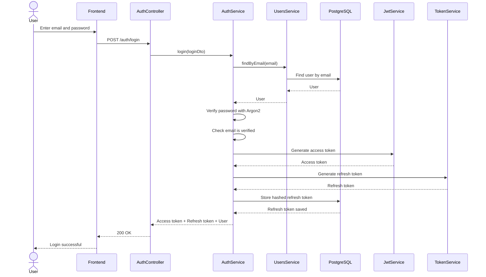
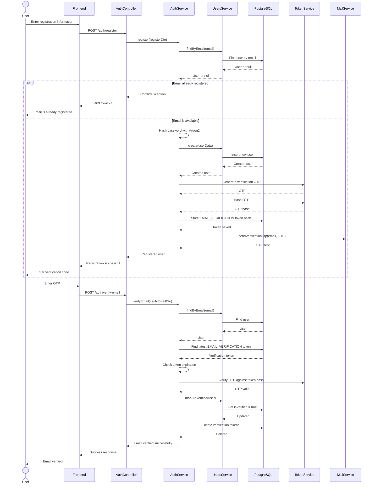
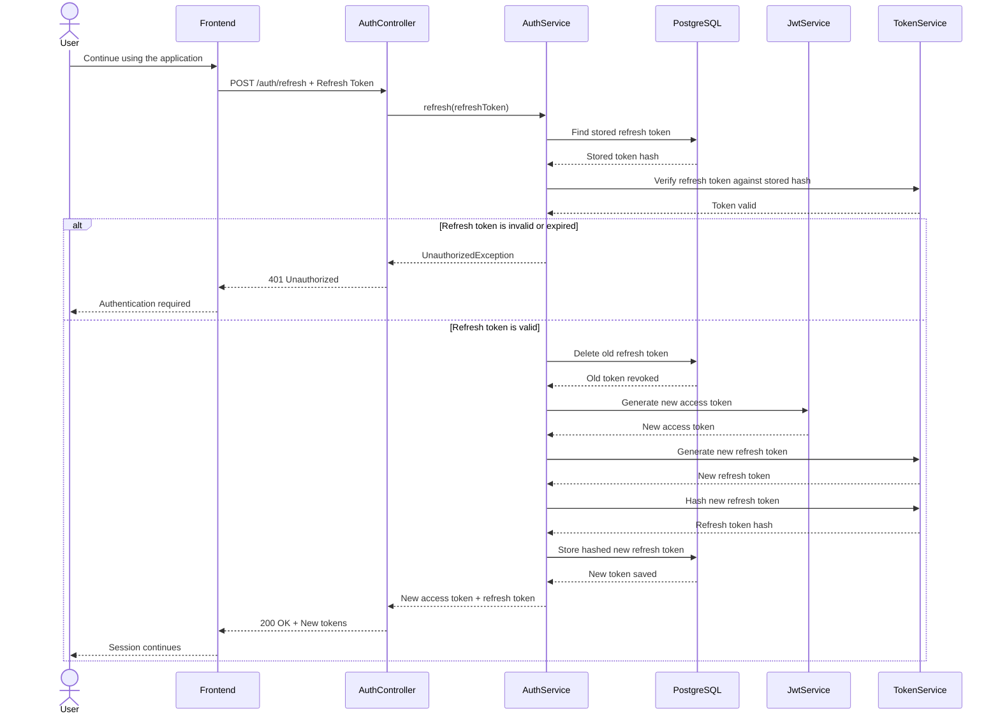
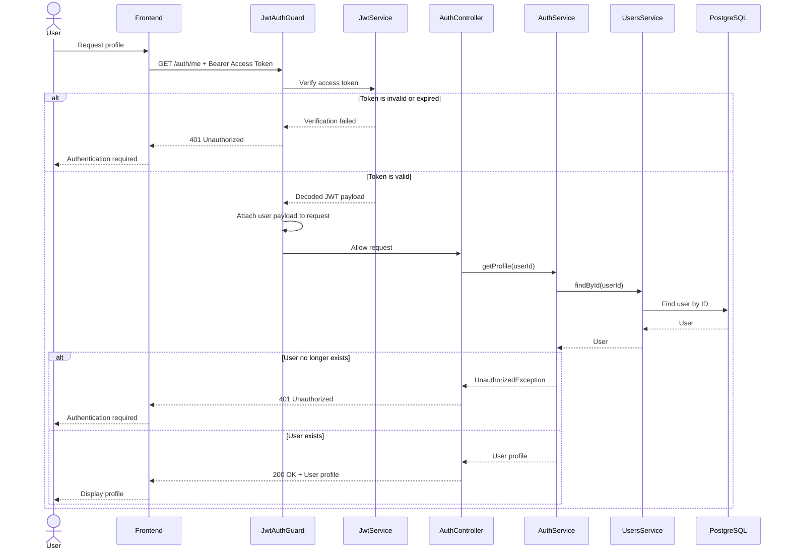
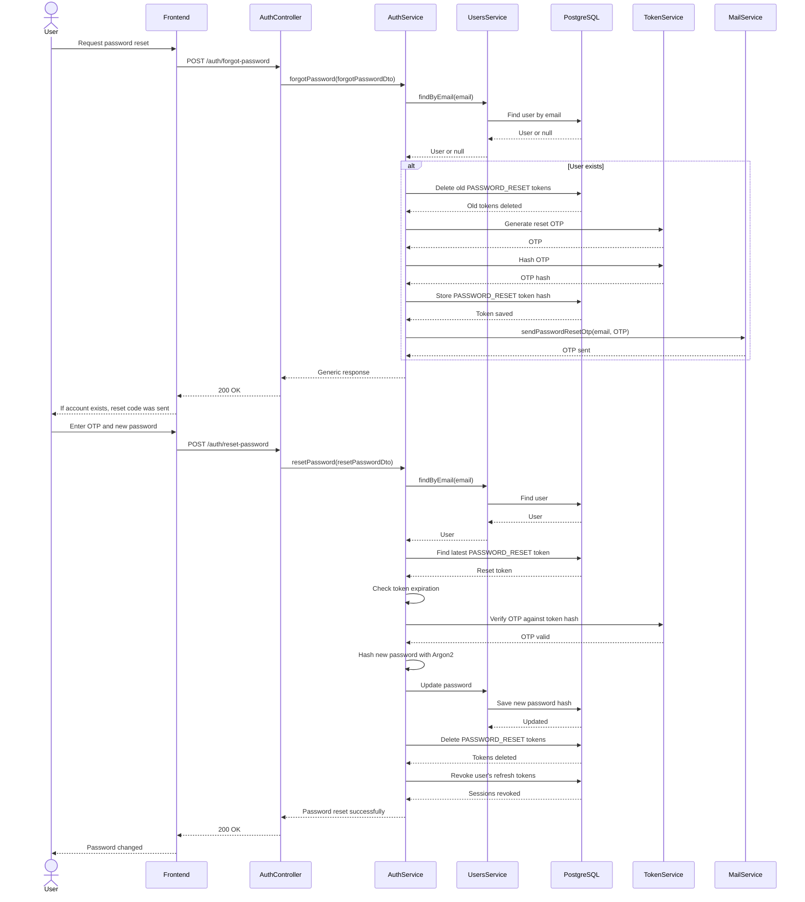
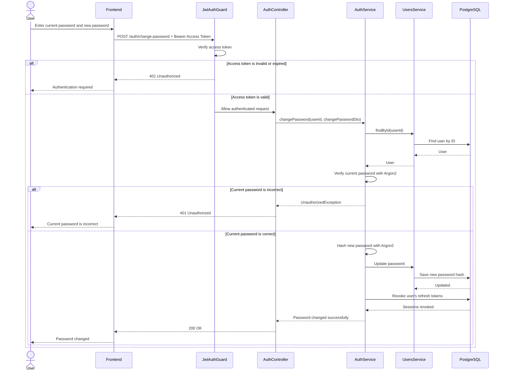
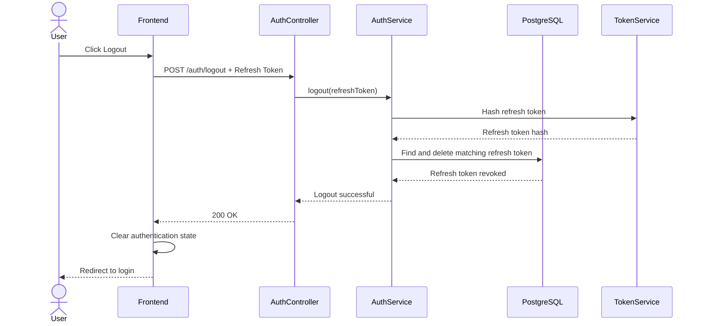

# LMS Backend Sequence Diagrams

This document describes the main authentication flows implemented in the LMS backend.

## Login Flow

## Registration and Email Verification Flow

## Refresh Token Rotation Flow

## Protected Route - JWT Authentication Flow

## Forgot and Reset Password Flow

## Change Password Flow

## Logout Flow

